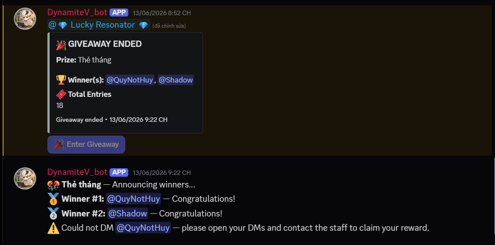
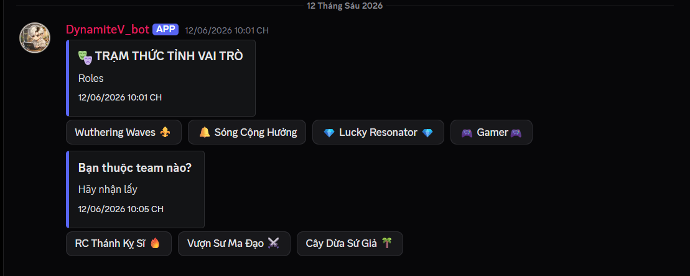
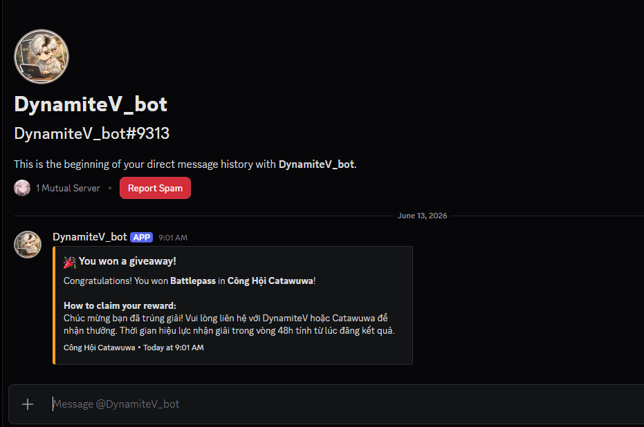
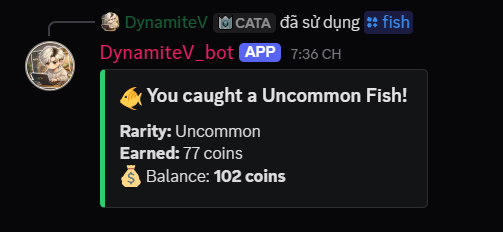
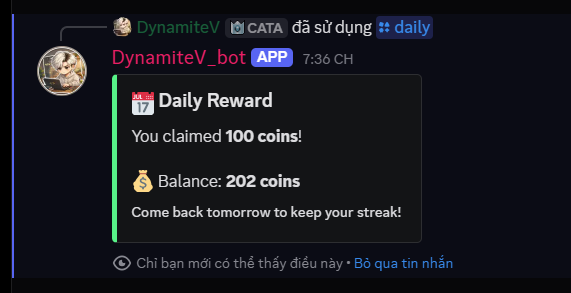

<div align="center">

# ⚡ Dynamite Core

**A self-hosted Discord management platform built with .NET 8 and Clean Architecture.**

[](https://github.com/balocvu3105-dd/Dynamite_Core/actions)
[](https://dotnet.microsoft.com)
[](https://github.com/discord-net/Discord.Net)
[](https://www.postgresql.org)
[](LICENSE)

</div>

---

## What is this?

Dynamite Core is a **production-grade Discord bot platform** combining the best features of Dyno, Carl-bot, and MEE6 into a single self-hosted solution. It's built as a serious portfolio project to demonstrate real-world architectural thinking — not just a hello-world bot.

The codebase uses **Clean Architecture** with a modular system, a full **REST API**, a **React dashboard**, and is fully containerized with Docker. Every architectural decision was made with maintainability and scalability in mind.

---

## Features

### 🛡️ Moderation
`/ban` `/kick` `/timeout` `/untimeout` `/warn` `/warnings` `/purge` `/slowmode`

Role hierarchy validation, permission checks, and a configurable mod log channel. Punishment history is persisted to the database.

### 🎭 Role Management
Auto role on join, button roles, select menu role panels — multi-panel support with persistent configuration. Dynamic component handling via Discord interaction IDs.

### ⚙️ Server Setup
`/setup gaming` `/setup community` `/setup streamer`

Generates categories, channels, roles, and permission overwrites from reusable templates in a single command.

### 📋 Logging
Tracks message edits/deletes, member joins/leaves, role changes, and voice state changes — each configurable to its own channel.

### 👋 Welcome & Verification
Welcome embeds with dynamically generated banner images (SkiaSharp), one-click verification with role assignment, and account age filtering against bot accounts.

### 🔒 Anti-Spam & Security
Anti-spam, anti-mention spam, anti-invite, anti-scam link detection. Anti-raid engine with escalating response: **warn → timeout → ban**.

### 🎉 Giveaway
`/giveaway start` with human-readable duration parser (`1d2h30m`), button-based entry with deduplication, background timer service that **survives bot restarts**, `/giveaway reroll`, `/giveaway cancel`.

### 🎫 Ticket System
Panel-based ticket creation, auto-channel with scoped permission overwrites, full lifecycle: **Open → Close → Delete**.

### 🪙 Economy & Fishing

A full economy system built around a fishing minigame with layered progression mechanics.

**Core commands:** `/daily` (streak bonuses), `/balance`, `/transfer`, `/level`, `/leaderboard fishing|chat|voice|collector`

**Fishing system** — `/fishing cast` | `/fishing pond` | `/fishing profile` | `/fishing achievements` | `/fishing pools` | `/fishing pool-cast`

- Drop table: Trash → Common → Uncommon → Rare → Legendary → Mythic, with Bronze / Gold / Diamond chest drops
- **Fishing rods** (Tân Thủ → Tre → Bạc → Vàng → Kim Cương): each rod reduces miss/escape rate, boosts drop multiplier, and tracks **durability**. Broken rods auto-repair on next cast (cost deducted)
- **Lucky Points** — Cần Câu Kim Cương carries **+1 May Mắn** (Rare +10% weight · Legendary +15% weight). Hard cap: Rare+Legendary+Mythic ≤ 40% of total weight
- **Weather system**: Sunny / Cloudy / Rainy / Stormy — affects miss rate and drop multiplier. Changes on a background schedule with server announcements
- **Special Pool** — Level 20+ zone with a separate high-rarity drop table. Requires a Vé Pool Đặc Biệt item per cast
- **Auto-fish** — `/auto-fish start|stop|status`: background scheduler casts on the user's behalf at configurable intervals, respects rod durability and bait consumption
- **Pond system** — server-wide fish stock that depletes with catches and regenerates over time
- **Bait items**: Mồi Câu Thường / Cao Cấp (+Rare chance). Phép Triệu Mưa activates Rainy weather for 60 min

**Shop** — `/shop view|buy|inventory|use|repair-rod`: items seeded per guild, invoice channel for purchase history, bag expansion up to 100 slots

### 🖥️ Web Dashboard
React 19 + Vite dashboard with Discord OAuth2 login. Server configuration pages are functional — remaining modules are in active development.

---

## Preview

<table>
  <tr>
    <td align="center"><b>👋 Welcome</b></td>
    <td align="center"><b>🎉 Giveaway</b></td>
    <td align="center"><b>🎭 Role Panel</b></td>
  </tr>
  <tr>
    <td></td>
    <td></td>
    <td></td>
  </tr>
  <tr>
    <td align="center"><b>📬 Giveaway DM</b></td>
    <td align="center"><b>🎣 Fishing</b></td>
    <td align="center"><b>🪙 Economy</b></td>
  </tr>
  <tr>
    <td></td>
    <td></td>
    <td></td>
  </tr>
</table>

---

## Architecture

```
src/
├── Dynamite.Core                  # Entities, interfaces — zero external dependencies
├── Dynamite.Application           # Service interfaces, use-case orchestration
├── Dynamite.Infrastructure        # EF Core, repositories, PostgreSQL, external services
├── Dynamite.Shared                # Cross-cutting utilities
├── Dynamite.Bot                   # Discord bot host, event handlers, slash commands
├── Dynamite.API                   # ASP.NET Core REST API
├── Dynamite.Tests                 # xUnit unit tests
├── Dynamite.Modules/
│   ├── Moderation
│   ├── Welcome
│   ├── RoleManagement
│   ├── Setup
│   ├── Logging
│   └── Security
├── Dynamite.Modules.Giveaway
├── Dynamite.Modules.Ticket
├── Dynamite.Modules.Economy
└── dynamite-dashboard             # React 19 + Vite dashboard
```

**Dependency direction:**
```
Core  ←  Application  ←  Infrastructure  ←  Bot / API
```

Each module is an independent class library. Zero coupling between modules — communication only through service interfaces defined in `Dynamite.Application`.

### Key design decisions

| Decision | Why |
|---|---|
| Discord.Net types excluded from Application layer | Service interfaces use primitive `ulong` IDs — keeps the domain portable and independently testable |
| `IServiceScopeFactory` in Singleton event handlers | Discord.Net registers handlers as singletons; scoped DbContext requires explicit scope creation |
| `SafeRun` fire-and-forget pattern | Isolates handler crashes from the Discord.Net event loop — one bad handler can't take down the bot |
| Background polling for giveaway timers | Timer survives bot restarts; `Task.Delay`-based timers are lost on shutdown |
| `IMemoryCache` for fishing cooldowns | Avoids a DB round-trip on every command; acceptable data loss on restart given the use-case |
| Weighted drop table with hard cap | Rare+Legendary+Mythic capped at 40% total weight — luck modifiers redistribute weight from Common/Uncommon rather than inflate the pool, keeping math honest |
| Auto-fish as a hosted background service | `AutoFishScheduler` runs as `IHostedService`; per-user timers survive individual command failures without blocking the event loop |
| Weather as an independent scheduler | Decoupled from fishing logic — `WeatherService` owns state, `WeatherChangeNotifier` announces changes. Fishing reads weather at cast time via DI |

---

## Tech Stack

| Layer | Technology |
|---|---|
| Bot Framework | Discord.Net 3.19.1 |
| Backend | .NET 8, ASP.NET Core |
| ORM | Entity Framework Core + Npgsql |
| Database | PostgreSQL 16 |
| Auth | JWT Bearer + Discord OAuth2 |
| Frontend | React 19, Vite, TailwindCSS |
| Image Generation | SkiaSharp |
| Logging | Serilog |
| Testing | xUnit + Moq |
| Containerization | Docker + Docker Compose |

---

## Getting Started

### Prerequisites
- [Docker Desktop](https